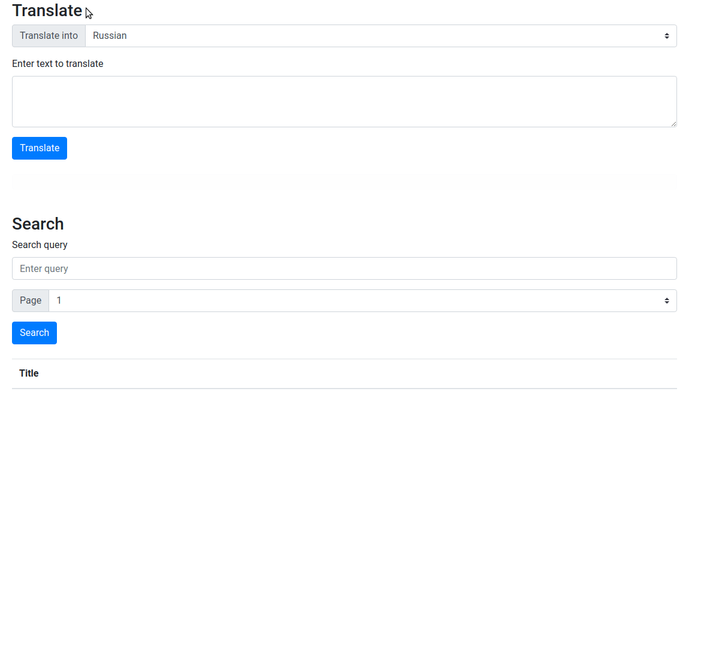

# google-puppeteer-crawler

A small web application that works as a proxy for Google Search and Google Translate. Written in Node.js and Express, heavily relies on Puppeteer usage - parses HTML page with results from Google.

Useful when running outside of Great Firewall of China when having issues with VPN connections.

Prerequisites: Node.js and npm.

```
npm install
node bin/www
```

# Demo




